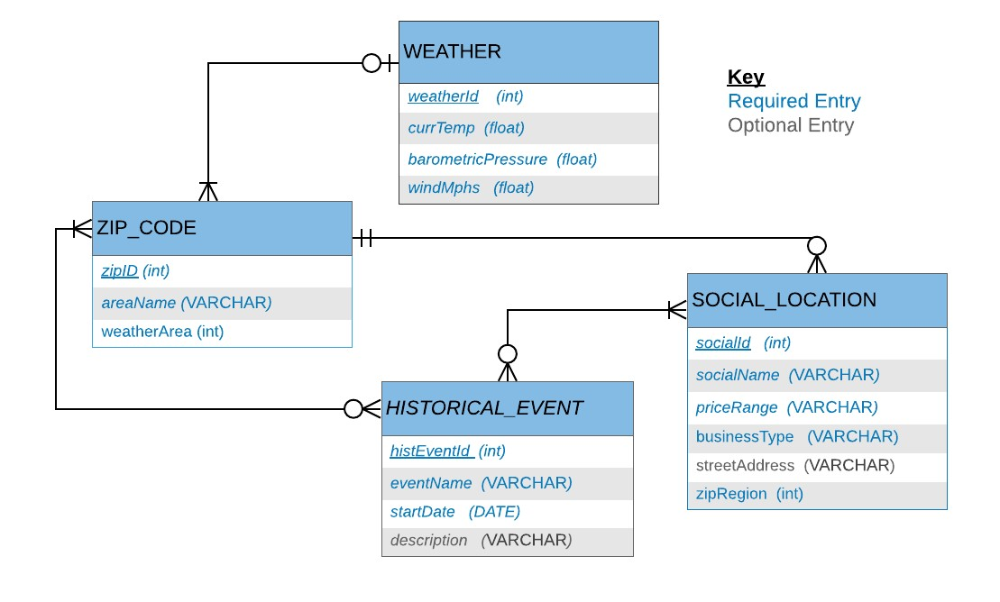
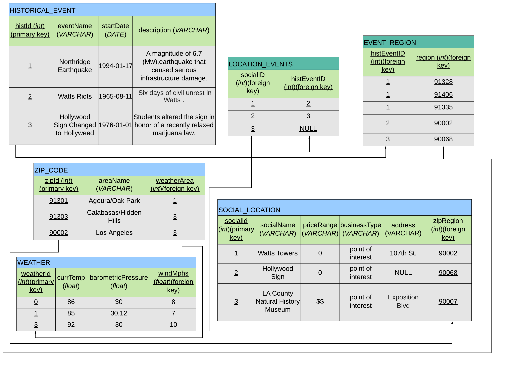

GoLA Community Database

Andrew Nguyen and Christine Bruton are Los Angeles natives with a passion for social-interaction and community engagement. GoLA is a community-based database interface which allows users to share social locations and historical events. The project supports Create, Read, Update, and Delete (CRUD) functionality and utilizes Bootstrap and Handlebars for a responsive and interactive user interface. The project is modularized based on the four main entities that the project supports: Social Location, Historical Event, Weather, and Zip Code. Additionally, mySQL database creation and manipulation queries are specified in the project's DDQ and DMQ files. 

Notes:
- the project was developed using a mySQL database and so a database connection including the host, user, password, and database are required in a .env file. A template_env_var.env is provided as reference.

